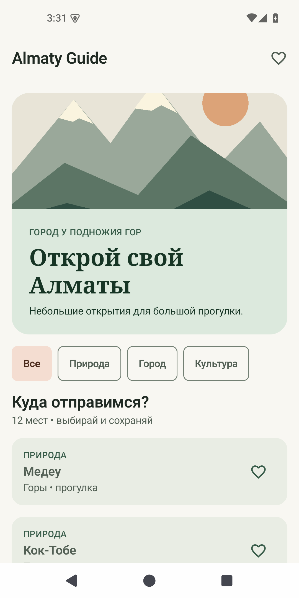
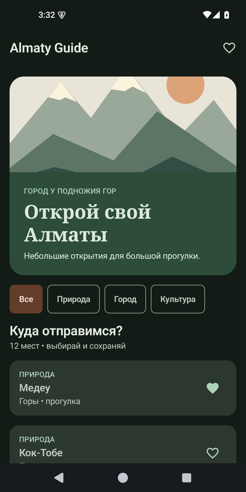
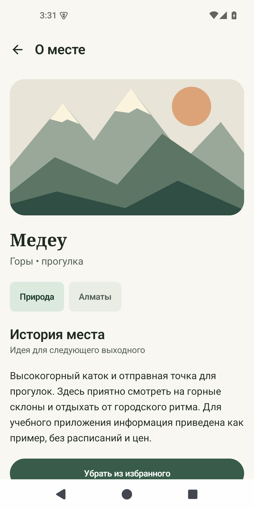
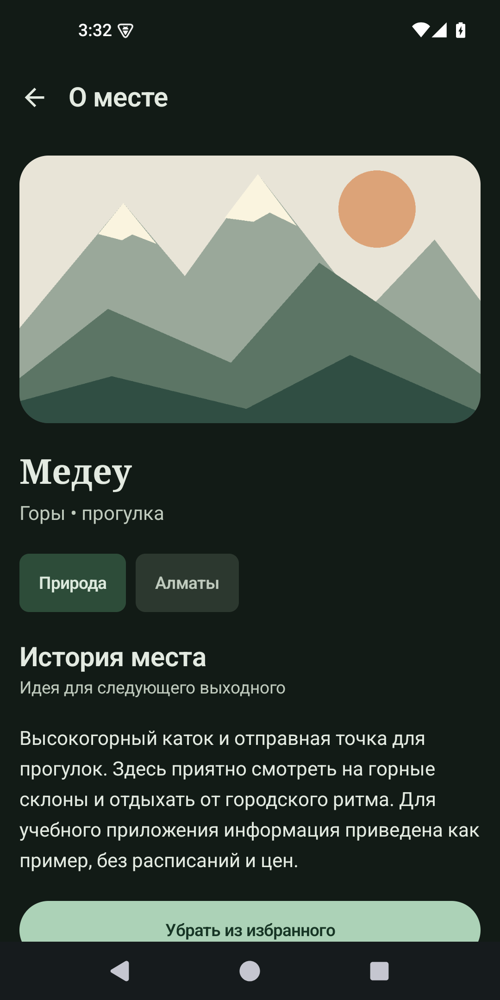
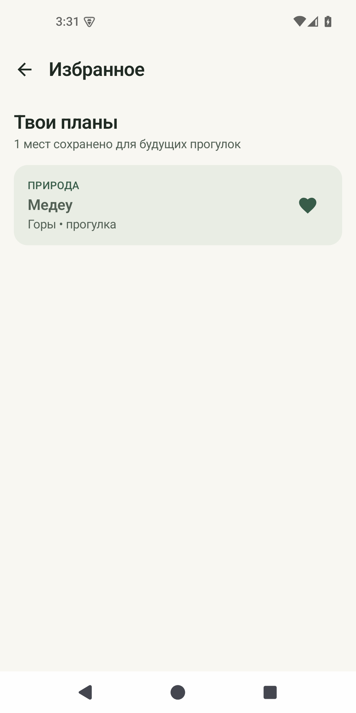
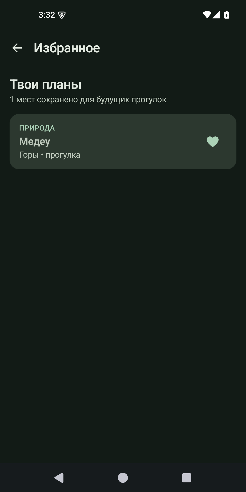

# Almaty Guide — SIS 3

Учебное Android-приложение на **Kotlin + Jetpack Compose + Material 3**. Каталог 12 мест Алматы: фильтры, подробности по ID и избранное. Работает офлайн, не требует регистрации и разрешений. Данные демонстрационные; это не актуальный туристический справочник.

## Запуск
1. Установите [Android Studio](https://developer.android.com/studio), если её ещё нет.
2. **Open** → выберите эту папку `AlmatyGuide-SIS3`.
3. Для Gradle используйте встроенный JDK Android Studio (17 или 21). Дождитесь синхронизации; интернет нужен только для загрузки зависимостей.
4. Создайте эмулятор Android API 35 либо подключите Android-телефон с Android 7.0+.
5. Нажмите ▶ Run для модуля `app`.

Gradle Wrapper включён, отдельная установка Gradle не нужна. Из терминала: `./gradlew assembleDebug`. Для проверки: `./gradlew lintDebug`.

Готовый APK, если сборка подтверждена, лежит в `release/AlmatyGuide-debug.apk`. Перенесите его на Android-телефон и откройте файл для установки. Это Android-приложение, macOS APK не запускает.

## Что внутри
- `MainActivity.kt`: общий state избранного, локальное сохранение, NavHost.
- `data/Place.kt`: `data class Place`, 12 объектов, поиск по ID.
- `ui/Screens.kt`: ListScreen, DetailScreen, FavoritesScreen и превью.
- `ui/Components.kt`: 6 собственных компонентов с параметрами и превью.
- `ui/theme/Theme.kt`: светлая/тёмная палитры, типографика, Spacing.
- `app/src/main/res/drawable-nodpi/mountains.png`: собственная иллюстрация, загружаемая через painterResource.
- `design/`: размеченные макеты, добавленные первым локальным коммитом.
- `screenshots/`: реальные снимки приложения; статус проверки — в VALIDATION.md.
- `DEFENSE.md`: краткая подготовка к защите.
- `AI_USAGE.md`: честное описание использования AI.
- `REQUIREMENTS.md`: сопоставление пунктов задания с исходниками.

Пути Kotlin указаны относительно `app/src/main/java/kz/student/almatyguide/`.

## Скриншоты
| Экран | Светлая тема | Тёмная тема |
|---|---|---|
| Каталог |  |  |
| Подробности |  |  |
| Избранное |  |  |

Пустое избранное: `screenshots/empty-light.png`. Для смены темы включите тёмную тему в системных настройках Android.

## От макетов к приложению
Структура сохранена: Scaffold → TopAppBar → LazyColumn; в каталоге — Card с Image и Column, LazyRow категорий, список PlaceCard. В подробностях — изображение, текст, теги, кнопка сохранения. В избранном — тот же PlaceCard либо EmptyState.

Изменения относительно эскизов: добавлен раскрываемый совет с AnimatedVisibility, локальное сохранение избранного и отдельная защита от неизвестного ID. Эскиз «пустое избранное» представляет альтернативу списку, а не дополнительный блок под ним. Изображение намеренно стилизованное, а не фотография достопримечательности.

## Честный статус требований вне кода
Проект опубликован в публичном репозитории GitHub: https://github.com/Abdrakhmanov-dev/SIS-3-Android-development-. История осмысленных коммитов перенесена без изменений, первый коммит содержит только `design/`. Все коммиты сделаны в день подготовки; требование «за неделю»/«за две недели» не выполнено и история не подделывалась. В PDF эти два срока указаны противоречиво.

Макеты созданы с помощью Codex в SVG. Задание просит **собственные эскизы на бумаге или в Figma**: импортируйте SVG в Figma и самостоятельно осмысленно доработайте либо нарисуйте собственные схемы до сдачи. Это нельзя выдавать за вашу ручную работу.

Ссылку на репозиторий нужно отправить в Teams, как требует PDF. Личная защита и понимание каждой строки остаются за студентом. Приложение и документы не гарантируют эти организационные баллы.
